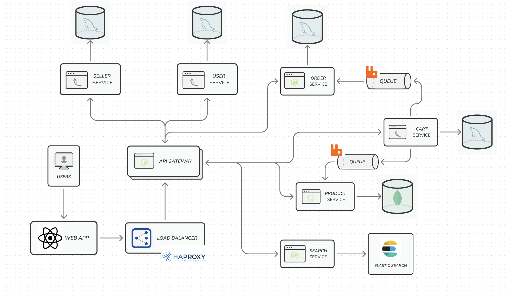

# E-commerce Application

E-commerce application created using a microservices-based architecture.

## Features

1. Seller

- Create Account
- List Product
- Edit Products
- View Orders

2. User

- Create Account
- Add to Cart
- Checkout
- Search for Products

## High-level Design

This is the initial design that I plan to work on. Each service in will be its own containerized application.
